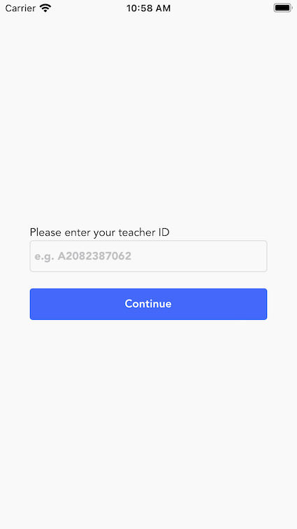

# Class Attendance App

## Description

This is an application built with React Native to help teachers see which students are in their class each day of the week.

## Setup

### Prerequisites

- Node.js
- Yarn or npm

### Installation

1. Clone the repository: 
   `git clone https://github.com/mtzngn/ClassTracker.git` 
   `cd ClassTracker`

2. Install dependencies: 
   `yarn install` 
   `cd ios && pod install && cd ..`

3. Create a .env file in the root directory and add your API token: 
   API_TOKEN=your_api_token_here

4. Run the application with: 
   `yarn start` 
   For ios: 
   `yarn run ios` 
   For android: 
   `yarn run android`

### Usage

1. On the home page, enter your teacher ID to view your classes for each day. 
    
2. Class List screen will display the classes that are related to the teacher AND the classes that has lesson.
    

3. Finally, Class Details screen will display the attendees for that lesson in that class, with the time of lesson.
   

Note: If there is no class or if there is no lessons in that class, class list screen will not display the classes.
